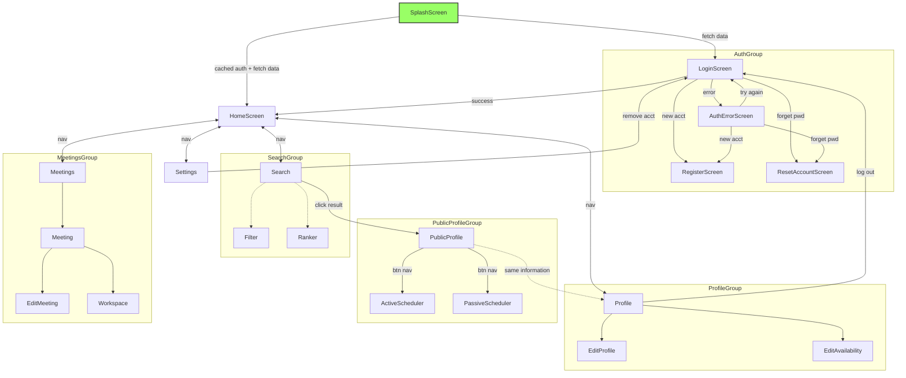

# Potential App Flow

You might need to scale the screen down to see the entire diagram.

```mermaid
graph TD
  SplashScreen --> |fetch data| LoginScreen
  SplashScreen --> |cached auth + fetch data| HomeScreen
  subgraph AuthGroup
    LoginScreen --> |new acct| RegisterScreen
    LoginScreen --> |forget pwd| ResetAccountScreen
    LoginScreen --> |error| AuthErrorScreen
    AuthErrorScreen --> |try again| LoginScreen
    AuthErrorScreen --> |forget pwd| ResetAccountScreen
    AuthErrorScreen --> |new acct| RegisterScreen
  end
  LoginScreen --> |success| HomeScreen
  HomeScreen <--> |nav| Search
  HomeScreen <--> |nav| Profile
  HomeScreen <--> |nav| Meetings
  HomeScreen <--> |nav| Settings
  
  Settings --> |remove acct| LoginScreen

  subgraph ProfileGroup
    Profile --> EditProfile
    Profile --> EditAvailability
  Profile --> |log out| LoginScreen
  end

  subgraph SearchGroup
    Search -.-> Filter
    Search -.-> Ranker
  end
  Search --> |click result| PublicProfile

  subgraph PublicProfileGroup
    PublicProfile --> |btn nav| ActiveScheduler
    PublicProfile --> |btn nav| PassiveScheduler
  end
  PublicProfile -.-> |same information| Profile

  subgraph MeetingsGroup
    Meetings --> Meeting
    Meeting --> EditMeeting
    Meeting --> Workspace
  end

  classDef green fill:#9f6,stroke:#333,stroke-width:2px;
  class SplashScreen green
```
